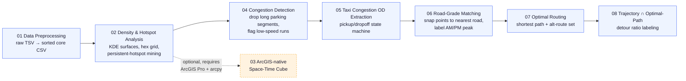
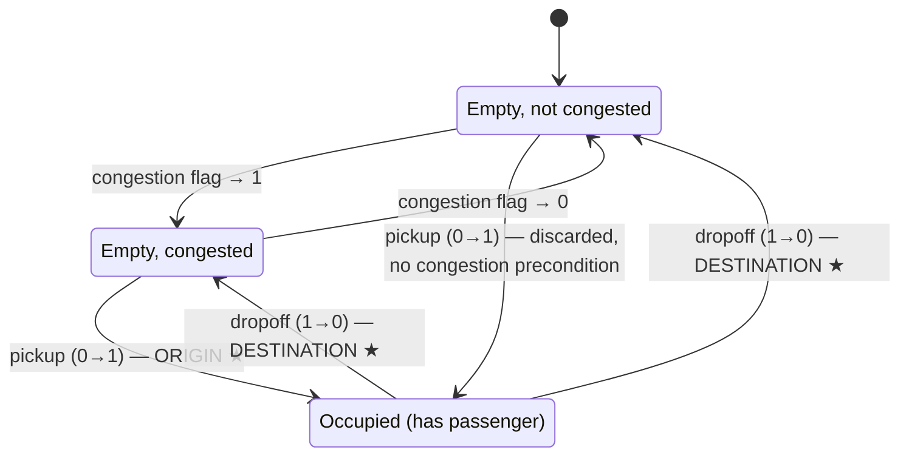

<p align="right"><a href="README.zh-CN.md">中文</a></p>

<h1 align="center">Beijing Taxi GPS Detour Analysis</h1>

<p align="center">


</p>

An 8-stage geospatial data pipeline that turns raw Beijing taxi GPS traces into a **congestion-induced detour signal**: from millions of raw GPS pings, it extracts persistent traffic hotspots, detects congestion segments, reconstructs origin-destination (OD) trips, matches them to the road network, computes theoretically optimal routes, and finally flags trips whose real trajectory was significantly longer than the shortest possible route.

This was a **team project**; this repository collects the pipeline stages and reference material it was built with.

## Pipeline overview



Two root-level notebooks, [`taxi_gps_pipeline_zh.ipynb`](taxi_gps_pipeline_zh.ipynb) (Chinese) and [`taxi_gps_pipeline_en.ipynb`](taxi_gps_pipeline_en.ipynb) (English), are a single-file, bilingual mirror of the exact same 8-stage pipeline (66 cells each). They default to a safe dry-run mode (`EXECUTE_PIPELINE = False`) and gracefully skip missing optional imports, so they're a good place to start reading before diving into the individual scripts.

## Highlight algorithm: congestion-gated OD extraction

The core idea of Stage 4 lives in [`pipeline/05_taxi_congestion_od_extraction/03_extract_od_trips.py`](pipeline/05_taxi_congestion_od_extraction/03_extract_od_trips.py) (`find_trips_for_vehicle`): a lightweight three-state state machine that turns a per-vehicle stream of GPS pings into origin–destination (OD) trips, but only counts a trip whose pickup was directly triggered by congestion:

- **Origin (O)** — the point where a vehicle flips from empty to occupied, but *only* if the point immediately before that flip was flagged `congestion == 1`. A pickup not preceded by congestion is discarded outright, not counted as a trip.
- **Destination (D)** — the first point after that occupied run flips back to empty; no congestion condition applies here.



**Why it matters analytically**: this precondition isolates exactly the subset of trips whose passenger was picked up *while the taxi was stuck in traffic* — precisely the population that `07_optimal_routing`/`08_trajectory_optimal_path_intersection` later test for abnormal detours, instead of diluting the detour signal across every trip regardless of how it started.

**Implementation notes**:
- Run boundaries are found with a single vectorized `numpy.where(occ[1:] != occ[:-1])` diff per vehicle instead of a row-by-row Python loop, so it scales to tens of millions of GPS points.
- Every trip is also stamped `is_plausible` using haversine straight-line distance **and** a duration cap, not speed alone — a real corrupted-timestamp bug (+6 years) once produced a trip whose implied average speed was only ~200 meters/hour (comfortably under the 150 km/h ceiling, so a speed-only check would have called it "plausible"), even though the trip's duration was actually 189 million seconds (~6 years). The separate duration cap is what catches this class of error.

## Repository structure

```
.
├── taxi_gps_pipeline_zh.ipynb         # Master pipeline notebook (Chinese)
├── taxi_gps_pipeline_en.ipynb         # Master pipeline notebook (English)
└── pipeline/
    ├── 01_data_preprocessing/                       # Stage 1 — raw TSV → sorted CSV
    ├── 02_density_hotspot_analysis_opensource/       # Stage 2 — KDE density, hex grid, persistent hotspots, open-source (no arcpy)
    ├── 03_arcgis_space_time_cube/                    # Optional — arcpy/ArcGIS Pro space-time cube
    ├── 04_congestion_detection/                      # Stage 3 — congestion segment detection
    ├── 05_taxi_congestion_od_extraction/             # Stage 4 — pickup/dropoff (OD) trip extraction
    ├── 06_road_grade_matching/                       # Stage 5 — snap GPS points to nearest road + time-period label
    ├── 07_optimal_routing/                           # Stage 6 — shortest path + near-optimal route set
    └── 08_trajectory_optimal_path_intersection/      # Stage 7 — real trajectory vs. optimal path → detour label
```

Each subfolder has its own `README.md` with the exact CLI usage, input/output schema, and method notes for that stage.

## Requirements

Almost the entire pipeline is pure open-source Python (`geopandas`, `shapely`, `rasterio`, `networkx`, `pandas`, `numpy`, `pyproj`, `pyogrio`, `tqdm`) and can be reproduced on any standard machine or cloud/CI runner. Two exceptions require a licensed **ArcGIS Pro** install with `arcpy`:

- `pipeline/03_arcgis_space_time_cube/` — the entire folder (native `arcpy.stpm` space-time cube)
- `pipeline/05_taxi_congestion_od_extraction/build_congestion_points.py` — an arcpy variant of point-to-feature conversion; the fully equivalent open-source version `01_build_points.py` in the same folder does **not** require arcpy

Install the core open-source dependencies with:

```bash
pip install numpy pandas pyproj rasterio geopandas shapely networkx pyogrio tqdm
```

(`pipeline/02_density_hotspot_analysis_opensource/requirements.txt` lists the minimal set needed for that stage specifically.)

## Data

This repository does **not** contain any real/raw taxi trip GPS records — those are private and excluded on purpose. It only ships the public reference geodata the pipeline needs: Beijing province/county administrative boundaries (`02_density_hotspot_analysis_opensource/boundary/`) and a 2017 Beijing road network shapefile (`06_road_grade_matching/2017_Beijing_road.*`), plus a synthetic-data demo notebook (`05_taxi_congestion_od_extraction/notebook/taxi_od_pipeline_part1-5.ipynb`) you can run end-to-end without any real data.

## License

Released under the [MIT License](LICENSE).
