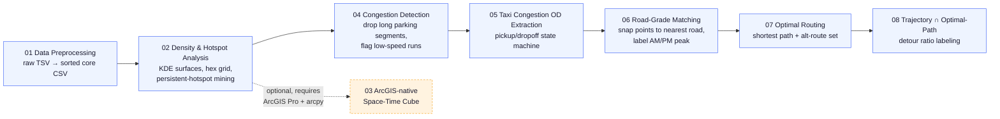

<p align="right"><a href="README.zh-CN.md">中文</a></p>

# Beijing Taxi GPS Detour Analysis


An 8-stage geospatial data pipeline that turns raw Beijing taxi GPS traces into a **congestion-induced detour signal**: from millions of raw GPS pings, it extracts persistent traffic hotspots, detects congestion segments, reconstructs origin-destination (OD) trips, matches them to the road network, computes theoretically optimal routes, and finally flags trips whose real trajectory was significantly longer than the shortest possible route.

This was a **team project**; this repository collects the pipeline stages and reference material it was built with.

## Pipeline overview



Two root-level notebooks, [`出租车GPS全流程.ipynb`](出租车GPS全流程.ipynb) (Chinese) and [`出租车GPS全流程_English.ipynb`](出租车GPS全流程_English.ipynb) (English), are a single-file, bilingual mirror of the exact same 8-stage pipeline (66 cells each). They default to a safe dry-run mode (`EXECUTE_PIPELINE = False`) and gracefully skip missing optional imports, so they're a good place to start reading before diving into the individual scripts.

## Repository structure

```
.
├── 出租车GPS全流程.ipynb              # Master pipeline notebook (Chinese)
├── 出租车GPS全流程_English.ipynb      # Master pipeline notebook (English)
└── 代码整理/
    ├── 01_数据预处理/                              # Stage 1 — raw TSV → sorted CSV
    ├── 02_密度与热点分析(opensource_pipeline)/       # Stage 2 — KDE density, hex grid, persistent hotspots, open-source (no arcpy)
    ├── 03_ArcGIS原生时空立方体/                     # Optional — arcpy/ArcGIS Pro space-time cube
    ├── 04_拥堵识别/                                 # Stage 3 — congestion segment detection
    ├── 05_出租车拥堵OD提取流水线/                    # Stage 4 — pickup/dropoff (OD) trip extraction
    ├── 06_道路等级匹配/                             # Stage 5 — snap GPS points to nearest road + time-period label
    ├── 07_最优路径/                                 # Stage 6 — shortest path + near-optimal route set
    └── 08_OD轨迹线集与最优路径集求交算法/            # Stage 7 — real trajectory vs. optimal path → detour label
```

Each subfolder has its own `README.md` with the exact CLI usage, input/output schema, and method notes for that stage.

## Requirements

Almost the entire pipeline is pure open-source Python (`geopandas`, `shapely`, `rasterio`, `networkx`, `pandas`, `numpy`, `pyproj`, `pyogrio`, `tqdm`) and can be reproduced on any standard machine or cloud/CI runner. Two exceptions require a licensed **ArcGIS Pro** install with `arcpy`:

- `代码整理/03_ArcGIS原生时空立方体/` — the entire folder (native `arcpy.stpm` space-time cube)
- `代码整理/05_出租车拥堵OD提取流水线/build_congestion_points.py` — an arcpy variant of point-to-feature conversion; the fully equivalent open-source version `01_build_points.py` in the same folder does **not** require arcpy

Install the core open-source dependencies with:

```bash
pip install numpy pandas pyproj rasterio geopandas shapely networkx pyogrio tqdm
```

(`代码整理/02_密度与热点分析(opensource_pipeline)/requirements.txt` lists the minimal set needed for that stage specifically.)

## Data

This repository does **not** contain any real/raw taxi trip GPS records — those are private and excluded on purpose. It only ships the public reference geodata the pipeline needs: Beijing province/county administrative boundaries (`02_.../boundary/`) and a 2017 Beijing road network shapefile (`06_道路等级匹配/2017_Beijing_road.*`), plus a synthetic-data demo notebook (`05_.../notebook/taxi_od_pipeline_part1-5.ipynb`) you can run end-to-end without any real data.

## License

Released under the [MIT License](LICENSE).
