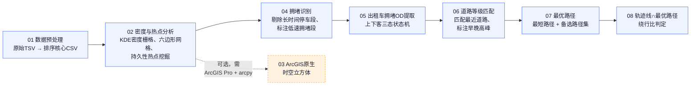

<p align="right"><a href="README.md">English</a></p>

# 北京出租车 GPS 拥堵绕行分析


一条 8 阶段的空间数据处理流水线，把北京出租车原始 GPS 轨迹逐步转化为**"拥堵引发绕行"的判定信号**：从千万级原始 GPS 定位点出发，提取持久性交通热点、识别拥堵路段、重建乘客上下车（OD）行程、匹配到实际路网、计算理论最优路径，最终标记出那些实际行驶距离显著超过理论最短路径的"绕行"行程。

这是一个**团队项目**，本仓库整理了该流水线各阶段的代码与相关参考资料。

## 流水线总览



根目录的两个 notebook —— [`taxi_gps_pipeline_zh.ipynb`](taxi_gps_pipeline_zh.ipynb)（中文）和 [`taxi_gps_pipeline_en.ipynb`](taxi_gps_pipeline_en.ipynb)（英文）—— 是同一条 8 阶段流水线的单文件中英双语镜像（各 66 个 cell）。默认安全干跑模式（`EXECUTE_PIPELINE = False`），且会优雅跳过缺失的可选依赖，适合在深入各子模块脚本之前先通读一遍建立整体认识。

## 仓库结构

```
.
├── taxi_gps_pipeline_zh.ipynb         # 主流水线 notebook（中文）
├── taxi_gps_pipeline_en.ipynb         # 主流水线 notebook（英文）
└── pipeline/
    ├── 01_data_preprocessing/                       # 阶段1 — 原始TSV转排序CSV
    ├── 02_density_hotspot_analysis_opensource/       # 阶段2 — KDE密度、六边形网格、持久性热点，纯开源(不依赖arcpy)
    ├── 03_arcgis_space_time_cube/                    # 可选 — arcpy/ArcGIS Pro时空立方体
    ├── 04_congestion_detection/                      # 阶段3 — 拥堵路段识别
    ├── 05_taxi_congestion_od_extraction/             # 阶段4 — 上下客(OD)行程提取
    ├── 06_road_grade_matching/                       # 阶段5 — GPS点匹配最近道路 + 时段标注
    ├── 07_optimal_routing/                           # 阶段6 — 最短路径 + 近似最优路径集
    └── 08_trajectory_optimal_path_intersection/      # 阶段7 — 真实轨迹与最优路径比较 → 绕行标签
```

每个子文件夹都有自己的 `README.md`，包含该阶段具体的 CLI 用法、输入/输出字段说明和方法说明。

## 依赖环境

流水线绝大部分是纯开源 Python（`geopandas`、`shapely`、`rasterio`、`networkx`、`pandas`、`numpy`、`pyproj`、`pyogrio`、`tqdm`），可以在任意标准环境或云端/CI runner 上复现。只有两处需要有授权的 **ArcGIS Pro** + `arcpy`：

- `pipeline/03_arcgis_space_time_cube/` — 整个文件夹（原生 `arcpy.stpm` 时空立方体）
- `pipeline/05_taxi_congestion_od_extraction/build_congestion_points.py` — 点转矢量的 arcpy 版本；同目录下功能完全等价的开源版 `01_build_points.py` **不需要** arcpy

安装核心开源依赖：

```bash
pip install numpy pandas pyproj rasterio geopandas shapely networkx pyogrio tqdm
```

（`pipeline/02_density_hotspot_analysis_opensource/requirements.txt` 列出了该阶段专用的最小依赖集。）

## 数据说明

本仓库**不包含**任何真实/原始的出租车行程 GPS 数据 —— 这类数据涉及隐私，有意排除在外。仓库中只包含流水线运行所需的公开参考地理数据：北京市省/县级行政区划边界（`02_density_hotspot_analysis_opensource/boundary/`）和 2017 年北京市路网 shapefile（`06_road_grade_matching/2017_Beijing_road.*`），以及一份可用合成数据完整跑通全流程的演示 notebook（`05_taxi_congestion_od_extraction/notebook/taxi_od_pipeline_part1-5.ipynb`），无需真实数据即可运行体验。

## License

本项目基于 [MIT License](LICENSE) 开源。
